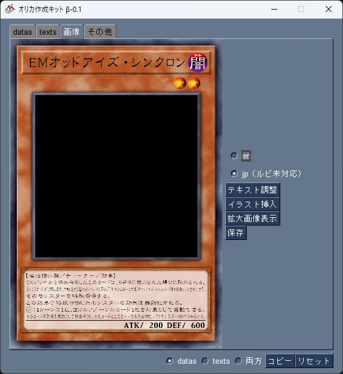

# オリカ作成Kit
オリカ作成Kitは、遊戯王ADS hollowにおいてオリカを作成する際の補助を目的としたツールです。\
入力されたデータからSQLとカード画像を作成します。

## 目次
* [オリカ作成Kit](#オリカ作成kit)
    * [機能](#機能)
    * [datas](#datas)
        * [ステータス](#ステータス)
            * [setcode](#setcode)
            * [Ｐスケール](#ｐスケール)
            * [Ｌマーカー](#ｌマーカー)
        * [プリセット&カードタイプ](#プリセット＆カードタイプ)
            * [トークン](#トークン)
            * [間にある「setcode」「type」「category」について](#間にあるsetcodetypecategoryについて)
        * [効果カテゴリー](#効果カテゴリー)
    * [texts](#texts)
        * [カード名＆英名](#カード名＆英名)
        * [テキスト](#テキスト)
            * [Ｐテキスト](#ｐテキスト)
        * [str](#str)
    * [画像](#画像)
        * [英／日の変換](#英／日の変換)
        * [テキスト調整](#テキスト調整)
        * [イラスト挿入](#イラスト挿入)
        * [拡大画像表示](#拡大画像表示)
    * [保存](#保存)
        * [名前](#名前)
        * [拡張子](#拡張子)
        * [幅&高さ](#幅高さ)
        * [保存先](#保存先)
    * [cdb](#cdb)
        * [レコードから読み込み](#レコードから読み込み)
        * [cdbに書き込み](#cdbに書き込み)
        * [レコードの削除](#レコードの削除)
        * [レコードの変更](#レコードの変更)
    * [インストール](#インストール)
    * [アンインストール](#アンインストール)
    * [実行](#実行)
    * [依存関係](#依存関係)
        * [ソースコードから実行する場合](#ソースコードから実行する場合)
    * [ライセンス](#ライセンス)
    * [免責事項](#免責事項)
    * [更新履歴](#更新履歴)

## 機能
オリカ作成Kitの機能は主に以下の２つです。
* カード名等のデータからdatas, textsそれぞれのSQLを生成
* カード名等のデータから画像を生成

## datas


主にカード情報を入力する部分です。

### ステータス
cdbと同様に入力します。\
入力欄に直接数値を入力することもできますし、矢印によって1刻み（atk/defは100刻み）で調整することもできます。

#### setcode
値を直接入力することもできますが、「setcode」ボタンを押すと専用のウィンドウが開きます。\
\
ここからカテゴリを選択して「反映」ボタンを押すことでそのカテゴリのsetcodeが入力されます。\
検索窓に入力した内容で絞り込みもできますが、ルビには対応していません。（クラウディアンは雲魔物と入力する必要があります。）\
複数のカテゴリにまたがる場合は、まずカテゴリを選択した後に「上」「中」「下」ボタンを押すことでそれぞれウィンドウの下側の入力欄に入れます。全て入力した後に「反映」を押すことでそれら全てに含まれるようなsetcodeが入力されます。

なお、ADSでの表示順は上からです。\


ここで表示されるカテゴリは同梱されている「setcode_ocg.txt」に記載されていますが、ADSの更新によってカテゴリが増えた場合は「setcode_ocg.txt」も更新する必要があります。\
「setcode_ocg.txtを再生成」ボタンを押し、カテゴリ名とsetcodeが書かれているファイルを選択することで更新できます。\
（2023/9/21時点ではOCGはADSの実行ファイルと同じディレクトリにある「strings_h.conf」に書かれています。）\
説明は省きますがオリカも同様です。

#### Ｐスケール
後述する[カードタイプ](#プリセット＆カードタイプ)の欄で「ペンデュラム」を選択することで変更することができます。

#### Ｌマーカー
後述する[カードタイプ](#プリセット＆カードタイプ)の欄で「リンク」を選択することで変更することができます。\
Ｌマーカーを変更する際はdef及びlevelの欄は変更不可になり、Ｌマーカーによって自動的に決定されます。\

### プリセット＆カードタイプ
カードの種類を入力します。\
プリセットが「フリー」の状態だと全ての項目を選択できますが、「モンスター」「魔法」「罠」を選択することで各種類事に選択可能なもののみが表示されるようになります。

#### トークン
トークンを作成する場合は「モンスター」「通常」「トークン」の３項目を入力してください。

#### 間にある「setcode」「type」「category」について
ここにはdatasで入力したsetcode、カードタイプ、後述する効果カテゴリーの数値が入力されます。\
クリックすることでクリップボードに各値をコピーできます。

### 効果カテゴリー
効果カテゴリーを入力します。

## texts
\
カード名やテキスト、効果ヒントの際のテキストを入力します。

### カード名＆英名
カード名に入力したものが日本語名として使われ、ADSに登録される名前になります。\
英名は後述する画像作成の際に英語のカードを作るときの名前として使用されます。そのため、英語カードを作らない場合は入力しなくても構いません。

### テキスト
カード名と同様に、日本語の方がADSに登録され、英語はカード作成にのみ使用されます。

#### Ｐテキスト
ADSのＰモンスターは【Ｐスケール：青～～】【モンスター効果】と入力する必要がありますが、SQLを作成する際に自動的に補完するのでＰ効果をそのまま入力してください。

### str
効果ヒントをそのまま入力してください。

## 画像
\
datas, textsに入力された内容から自動的にカード画像を生成します。

### 英／日の変換
en、jpのチェックによって切り替わります。

### テキスト調整
効果欄は先述のtextに入力された部分がそのまま入力されますが、ADSでの改行とカード画像での改行は一致しないため、その都度調整する必要があります。\
\
「テキスト調整」のボタンを押すとこのようなウィンドウが開きます。\
ここで改行の調整をすることで、効果欄を整えることができます。\
なおここでの変更はtextsには反映されないため、画像のみ改行位置が変わります。

### イラスト挿入
jpgまたはpngの画像を挿入できます。\
画像の大きさは自動で補正されますが、通常枠でもＰモンスター枠でも正方形に補正されるので元から正方形の方が歪みません。\


### 拡大画像表示
別タブでもう少し大きな画像を表示します。

## 保存
画像タブで「保存」ボタンを押すとウィンドウが開きます。\
\
各パラメータを正しく入力して「保存」ボタンを押すと保存できた旨のポップアップが、正しくない値がある場合はその旨のポップアップが表示されます。

### 名前
ファイル名です。ファイル名に使えない文字を使おうとするとエラーになります。

### 拡張子
現状jpgとpngです。

### 幅&高さ
生成する画像の幅と高さです。\
初期値の1180/1720が最大値で、「縦横比を固定」にチェックを入れると、どちらかを変更すると自動的にもう片方も変更されるようになります。

### 保存先
画像を保存する場所です。\
初期値だと実行ファイルと同じディレクトリに保存されます。

## cdb
\
cdbを操作する画面です。\
「選択」ボタンで読み込むcdbを選択し、「読み込み」ボタンで表示させます。\
一度選択したcdbのパスは保持されるため、何度も選択する必要はありません。

### レコードから読み込み
選択したレコードからidやカード名といった各種データをオリカ作成キットに反映させます。\
datasとtextsの両方が揃っていない場合は実行できません。

### cdbに書き込み
オリカ作成キットの内容をcdbに書き込みます。\
同じIDのカードが存在する等、書き込めない場合はエラーになります。

### レコードの削除
選択したレコードをcdbから削除します。\
datas, textsの片方を消してももう片方は消えません。

### レコードの変更
変更したいレコードをダブルクリックすると専用のウィンドウが開きます。\
\
ここで各種値を変更して「変更を保存」ボタンを押すことでレコードの値を変更できます。\
省略しますがdatasも同様です。

## インストール
[こちら](https://xgf.nu/P1BVR)からお願いします。

## アンインストール
インストールしたフォルダごと削除してください。

## 実行
zipファイルを解凍して出てきたoricaKit.exeを実行してください。

## 依存関係
pyperclip  == 1.8.2\
Pillow == 10.0.0\
opencv-python == 4.8.0.76\
numpy == 1.25.2\
PySimpleGUI == 4.61.0.198\
Nuitka == 1.8.2

### ソースコードから実行する場合
本ソースコードではPySimpleGUIのGitHubバージョンを使用しているため、pipでのインストールだけ動作しません。\
pipでPySimpleGUIをインストールしたのちに\
```python -m PySimpleGUI.PySimpleGUI upgrade```\
を実行してGitHubバージョンにしてください。

## ライセンス
このソースコードはLGPL v3.0によってライセンスされています。\
詳しくはLICENSE.txtをご覧ください。

## 免責事項
本ソフトウェアの利用によって生じた全ての損害・不具合等に関して
、本ソフトウェアの作成者は一切の責任を負いません。\
各自の責任においてご利用ください。\
また、作成者は本ソフトウェアの開発・配布をいつでも停止できるものとします。

## 更新履歴
<pre>
beta(v0.3)
画像の画質向上。画像の拡張子・寸法・保存先を記憶するように変更。10進数と16進数の相互変換を設置。
beta(v0.2)
cdbの読み込み・書き込み・レコードの削除・変更を実装
beta(v0.1.1)
日本語フォントが存在しない文字を使うと落ちる問題を修正
beta(v0.1)
新規作成
</pre>
